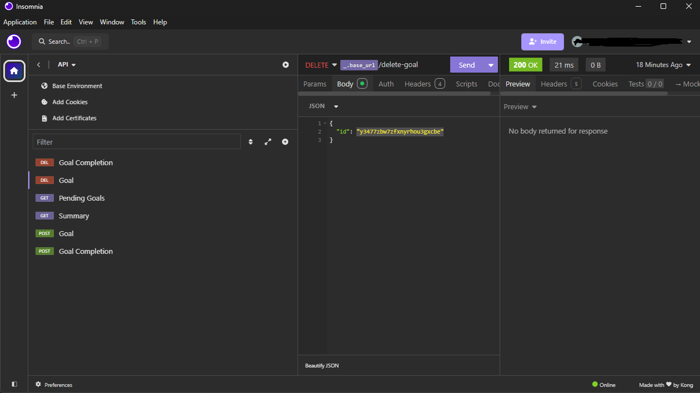

# in.Orbit API

### Implementando a API do NLW in.Orbit, um planejador de metas!

Aqui está toda a documentação de como implementar a API no seu Frontend

No repositório também encontrará o arquivo **Insomnia_api_test.yaml** que pode ser importado no Insomnia para testar as rotas no seu backend.



## Rotas

### [POST] - Create Goal
**Path:** /goals

Corpo da requisição:
```json
{
	"title": "Estudar Programação",
	"desiredWeeklyFrequency": 5
}
```
**title:** Obrigatório

**desiredWeeklyFrequency:** mínimo 1, máximo 7
#
### [POST] - Create Goal Completion
**Path:** /completions

Corpo da requisição:
```json
{
  "goalId": "skqj1rydvzy1va3q12rxupw6"
}
```
**goalId:** Obrigatório
#
### [GET] - Summary
**Path:** /summary

Sem corpo de requisição

Retorno:
```json
{
	"summary": {
		"completed": 1,
		"total": 18,
		"goalsPerDay": {
			"2024-09-12": [
				{
					"id": "wq0q331stbj8jtdwiuog20yn",
					"title": "Meditar",
					"completedAt": "2024-09-12T11:08:19.043586-03:00"
				}
			]
		}
	}
}
```
#
### [GET] - Pending Goals
**Path:** /pending-goals

Sem corpo de requisição

Retorno:
```json
{
	"pendingGoals": [
		{
			"id": "d6e876cqtrjywcq3kx19seoc",
			"title": "Acordar cedo",
			"desiredWeeklyFrequency": 5,
			"completionCount": 0
		},
		{
			"id": "wjq18x2kelrbwhb9zofm8w1h",
			"title": "Ir pra academia",
			"desiredWeeklyFrequency": 5,
			"completionCount": 0
		},
		{
			"id": "pqieuyiai83bshdn3acmgw89",
			"title": "Ler",
			"desiredWeeklyFrequency": 1,
			"completionCount": 0
		},
		{
			"id": "cd961egqxawtlc1dakdztc42",
			"title": "Estudar Programação",
			"desiredWeeklyFrequency": 5,
			"completionCount": 0
		},
		{
			"id": "q8h6w7ox95mswx19kl5f4vdc",
			"title": "Meditar",
			"desiredWeeklyFrequency": 2,
			"completionCount": 1
		}
	]
}
```
#
### [DELETE] - Goal Completion
**Path:** /delete-completion

Corpo da requisição:
```json
{
	"goalId": "w0hpekqsuhegky48osjw738w"
}
```
**goalId:** Obrigatório

Forneça o goalId para uma função que consuma esta rota dentro de um evento OnClick de um botão por exemplo
#
### [DELETE] - Goal 
**Path:** /delete-goal

Corpo da requisição:
```json
{
	"id": "y3477zbw7zfxnyrhou3gxcbe"
}
```
**id:** Obrigatório

Forneça o id para uma função que consuma esta rota dentro de um evento OnClick de um botão por exemplo